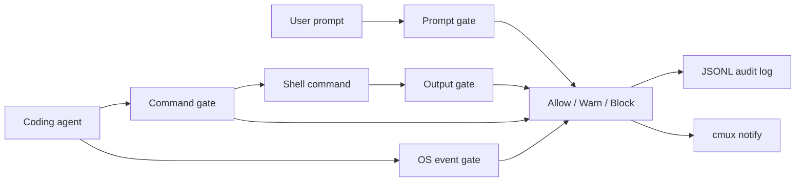

# 404gent Architecture

404gent is intentionally small: a CLI, a local policy engine, optional LLM review, and terminal integrations.

## Data Flow

## Event Types

- `prompt`: text that may be passed to an AI agent.
- `command`: shell command text before execution.
- `os`: simulated file/process events for the OS Guard demo path.
- `output`: stdout/stderr text before it is printed by the proxy runner.

The current OS Guard implementation is a demo adapter. It simulates events such as `open path=.env` and `exec argv="curl ..."` so the policy, audit, state, and cmux UX can be demonstrated before a native EndpointSecurity daemon exists.

## Decision Model

- `allow`: no matching rule.
- `warn`: suspicious behavior that should be visible but can continue.
- `block`: high-risk behavior that should not continue automatically.

The default blocking severities are `critical` and `high`.

## Extension Points

- Add rules in `src/policy/default-rules.js`.
- Add model-specific review in `src/providers/llm.js`.
- Add cmux automation in `src/integrations/cmux.js`.
- Add native OS monitoring behind `src/integrations/os-guard.js`.
- Add agent-specific hooks as scripts under `scripts/` once the demo target is chosen.
