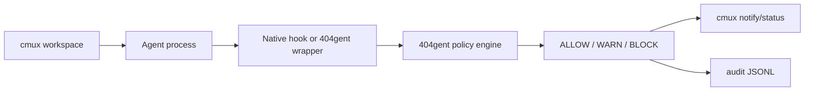

# cmux Agent Guard Status

## Short Answer

404gent can safely guard agent activity when the agent is launched through a 404gent wrapper or connected through native hooks.

It cannot yet magically intercept every already-running process inside cmux without a hook, wrapper, or cmux terminal interception API.

This is the right MVP boundary for the hackathon: cmux provides orchestration and visibility, while 404gent provides the runtime safety layer for connected agents.

## What Works Now

| Path | Detects Prompt | Blocks Prompt | Detects Command | Blocks Command | Scans Output | cmux UI |
| --- | --- | --- | --- | --- | --- | --- |
| `404gent scan-prompt` | yes | yes | no | no | no | notify |
| `404gent scan-command` | no | no | yes | yes | no | notify |
| `404gent run -- <cmd>` | no | no | launch command only | launch command only | yes | notify |
| `404gent agent --name ... --prompt ... -- <agent>` | yes | yes | launch command only | launch command only | yes | notify/status |
| Claude-style native hook template | yes | yes | yes for Bash tool payloads | yes | no | notify |
| Unwrapped existing cmux terminal process | no | no | no | no | no | no |

## Why

cmux provides a terminal, notification system, sidebar metadata, CLI, and socket API. That is enough to surface guard status and automate workspaces. It does not currently expose a documented API that lets 404gent transparently intercept every byte typed into every terminal and block it before the shell receives it.

So the safe architecture is:



## Generic Wrapper

```bash
node src/cli.js agent --name codex --prompt "Summarize README" -- codex
node src/cli.js agent --name gemini --prompt "Build the demo" -- gemini
node src/cli.js agent --name opencode --prompt "Fix tests" -- opencode
```

What this gives you:

- prompt preflight before launch
- launch command scan before execution
- output scanning and redaction
- per-agent audit source, for example `agent:codex:output`
- sticky status tracking in `.404gent/state.json`
- cmux status pill when cmux is available

Limitation:

- generic wrappers cannot see private internal tool-call payloads unless the agent prints them or exposes hooks

## Stronger Native Hook Path

For agents with hook systems, wire 404gent into:

- prompt submit hooks
- pre-tool-use hooks
- Bash/shell command hooks
- post-tool/output hooks if available

Example template:

```bash
examples/hooks/claude-code-404gent.sh
```

Installer:

```bash
bash scripts/install-claude-style-hook.sh --dry-run
bash scripts/install-claude-style-hook.sh
```

This path is stronger than a generic wrapper because it can block a tool call before the agent's own shell tool executes it.

## Demo

```bash
bash scripts/cmux-agent-demo.sh
```

Expected:

- safe agent runs
- malicious prompt blocks before launch
- secret-looking output is redacted
- audit tail shows `agent:<name>:...` sources
- `404gent status` shows clean/warning/danger/contaminated state

## Status Command

```bash
404gent status
404gent status --agent codex
404gent status sync
404gent status reset --agent codex
```

See `docs/STATUS_MODEL.md` for the sticky risk model.

## Next Integration Step

The next real product step is an installer that writes per-agent hook config for each supported agent:

- Claude Code: prompt and Bash tool hooks
- Codex: hook config when available in the installed version
- Gemini CLI: shell wrapper or hook config when available
- OpenCode/Aider/Goose: shell wrapper first, native hooks where supported

Each installer should produce a reversible change and a `doctor` check.
